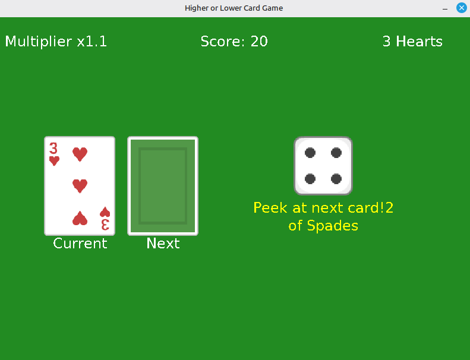
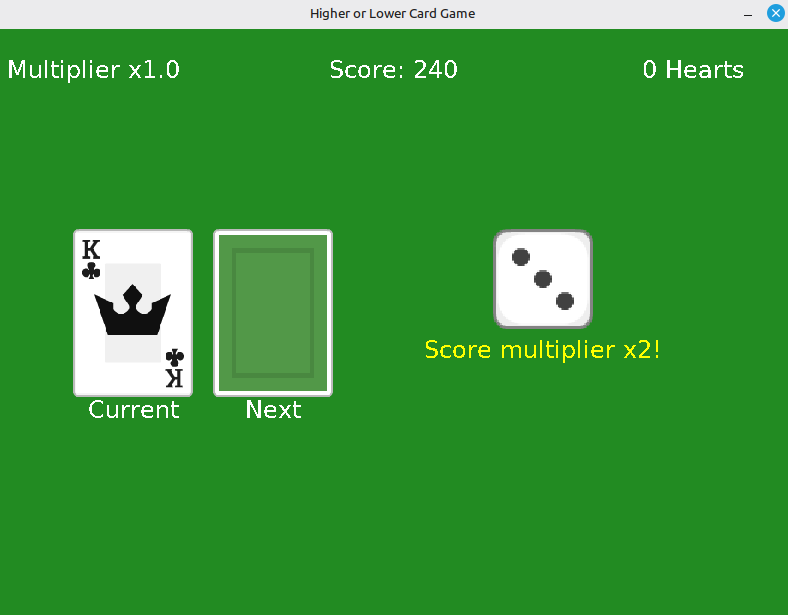
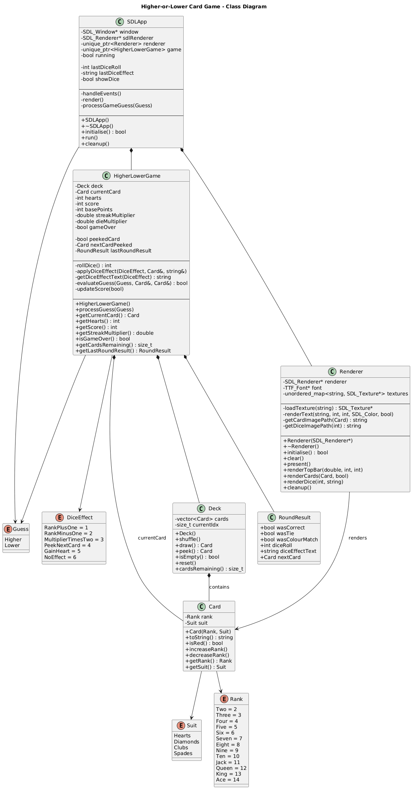

# higher-or-lower-card-game
A single player Higher-or-Lower card game implemented in C++17 and SDL2 graphical interface.

---
## 1. Project Overview
The **Higher-or-Lower Card Game** is a guessing game played with a standard 52 card deck. The basic aim of the game is for the player to guess whether the next card drawn will be higher or lower than the current card.

To give it an unique twist, this game includes:
* **Score**: players are aiming to get the highest score
* **Hearts**: the game ends when the player runs out of hearts
* **Dice mechanics**: players roll a dice and get different "effects" that impact the gameplay
* **Streak based score multiplier**: to reward players for correct guesses

---

## 2. Gameplay Overview & Unique Twist

### Basic Concept

At the core, this is a classic higher-or-lower game:
1. A card is shown
2. The player guesses whether the next card is higher or lower
3. The next card is revealed
4. THe score and player state are updated

### My Twist

To make the game more strategic and less luck based, I added:
* **Streak multipliers** that reward consistent correct guesses
* **Suit colour checks** Same suit colour in a row (red or black) triggers a dice roll
* **Dice effects** that temporarily modify rules (rank shifts, peeking next card, bonus hearts, score multiplier boosts)
* **Tie bonuses** Same rank ties reward players with an extra heart 
* **Infinite play** by reshuffling the deck with extra hearts bonuses
* **Heart system** Players start with 3 hearts and game ends when players have 0; Players can gain hearts throughout the gameplay

These additions create situations where the player must adapt their strategy instead of blindly guessing.

---

## 3. Game Rules

### Aim of the Game

* Achieve the **highest possible score**
* The game ends when **hearts reach 0**

---

### Player State

* **Hearts:** Start at 3
* **Score:** Start at 0
* **Streak Multiplier:** Starts at 1.0

  * +0.1 for each correct guess
  * Resets to 1.0 on a wrong guess
  * Capped at 2.0

---

### Core Rules

* Ace is always the **highest card**
* Correct guess:
  `+10 × multiplier` points
* Wrong guess:
  `-1 heart`, multiplier resets
* Same rank (tie):
  `+1 heart`
* Deck exhaustion:
  Deck reshuffles and player gains `+3 hearts`

---

### Colour & Dice Mechanics

If the **current card and next card have the same colour** (red or black):

* A **six-sided die is rolled**
* The effect applies **before evaluating the guess**

#### Dice Effects

| Roll | Effect                            |
| ---: | --------------------------------- |
|    1 | Next card rank +1                 |
|    2 | Next card rank −1                 |
|    3 | Multiplier ×2 for the next guess  |
|    4 | Peek at the next card             |
|    5 | Gain +1 heart                     |
|    6 | No effect                         |

Multiple bonuses (tie + dice) may stack.

---

## 4. Controls

| Key    | Action       |
| -------| ------------ |
| **H**  | Guess HIGHER |
| **L**  | Guess LOWER  |
| **Q**  | Quit game    |


## 5. Screenshots

### Gameplay
#### Gameplay Screenshot


#### My Highest Score (try and beat it ;) )


### Architecture
#### Class Diagram


---

## 6. Project Strucutre

```text
higher-lower-game/
├── README.md              # Project documentation
├── Makefile               # Build & run configuration
├── assets/                # Images and fonts
│   ├── cardBack_green3.png
│   ├── cardClubs2.png ... cardSpadesA.png
│   └── dieWhite_border1.png ... dieWhite_border6.png
├── include/               # Public headers
│   ├── Card.hpp           # Card model (rank, suit)
│   ├── Deck.hpp           # Deck management (shuffle, draw)
│   ├── HigherLowerGame.hpp# Core game logic
│   ├── Renderer.hpp       # SDL rendering abstraction
│   └── SDLApp.hpp         # Application & game loop controller
├── src/
│   ├── core/              # Game logic implementation
│   │   ├── Card.cpp
│   │   ├── Deck.cpp
│   │   └── HigherLowerGame.cpp
│   ├── ui/                # SDL2 UI implementation
│   │   ├── Renderer.cpp
│   │   └── SDLApp.cpp
│   └── main.cpp           # Program entry point
└── docs/                  # Diagrams & screenshots
```

---

## 7. Design & Architecture
### Separation of Concerns
* **Core game logic** contains no SDL code
* **UI layer** only interacts with the game via a minimal public API
* Rendering does not inspect or modify game rules

### Key design Decisions
* `HigherLowerGame` acts as the **single source of truth**
* `RoundResult` decouples UI feedback from internal logic
* `Deck` owns cards and draw order, preventing rule leakage
* Smart pointers (`std::unique_ptr`) manage ownership in the UI layer

This structure allows:
* Easy testing of core logic
* Future alternative UIs (CLI, web, etc.)
* Clean extensibility

---

## 8. Dependencies
### Required

* **C++17 or later**
* **SDL2**
* **SDL2_image**
* **SDL2_ttf**

### Installation

#### Ubuntu / Debian

```bash
sudo apt-get install libsdl2-dev libsdl2-image-dev libsdl2-ttf-dev
```

#### mac

```bash
brew install sdl2 sdl2_image sdl2_ttf
```

---

## 9. Build & Run Instructions

```bash
# Build the project
make build

# Build and run
make run

# Clean build artifacts
make clean
```

---

## Future Improvements

Further extensions could include:
* Adding **Jokers** with unique effects
* A **statistics screen** (win rate, longest streak)
* Difficulty modes (starting hearts, multiplier caps)
* Sound effects and animations
* Saving high scores to disk

---

# Thank you for taking the time to review my submission.
